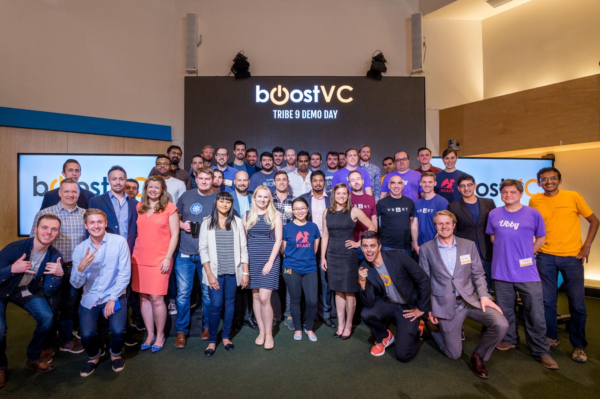

#### Chadwick Strange
- Berkeley-Haas MBA
- [@chadwickstrange](https://twitter.com/chadwickstrange)

 <!-- .element height="50%" width="50%" -->

#### Chadwick Strange
- BoostVC Tribe9
- [@chadwickstrange](https://twitter.com/chadwickstrange)

## What is blockchain technology

## Asymmetric cryptography

## Distributed systems

## What is blockchain technology
- Database structure
- Distributed system
- Method of consensus

## What is blockchain technology

## Blockchain technology applications
- Fintech
- New business models & platforms
- Identity
- IoT
- Healthcare
- ...
- Token sales

