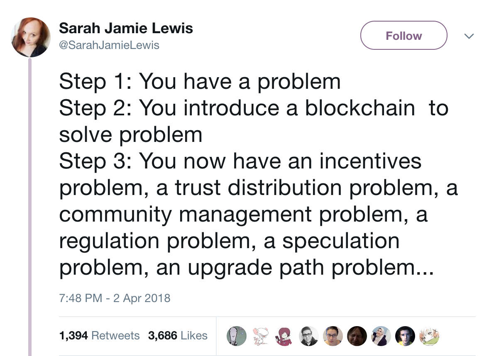
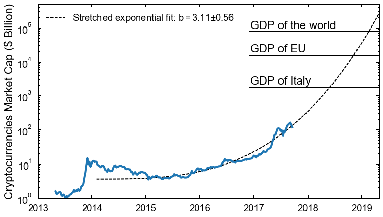

## Unintended consequences
#### Lottery-based rewards
<!-- .element height="70%" width="70%" -->

<!-- startups are awash with money & tokens with no natural demand -->
<!-- only lever for price action is modifying supply through granting app layer projects -->
## Control for supply

## Complexities

## Market dynamics, extrapolated

###### Source: [@Blockonomics](https://blog.blockonomics.co/the-cryptocurrency-rally-will-slow-down-simple-maths-says-ca581c48eb1e)

## Conclusion
Complex economic networks create many unknowns

## Thank you
- [@chadwickstrange](https://twitter.com/chadwickstrange)